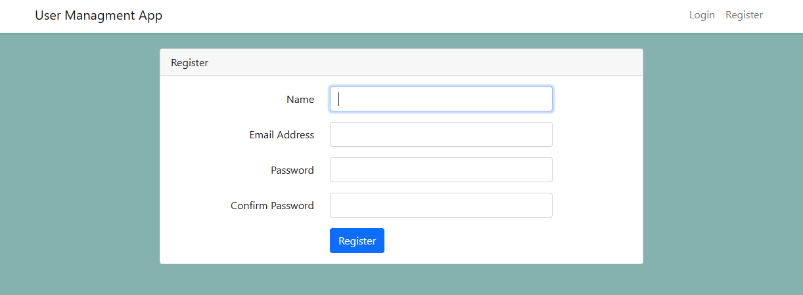
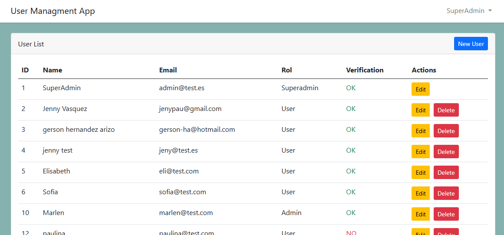
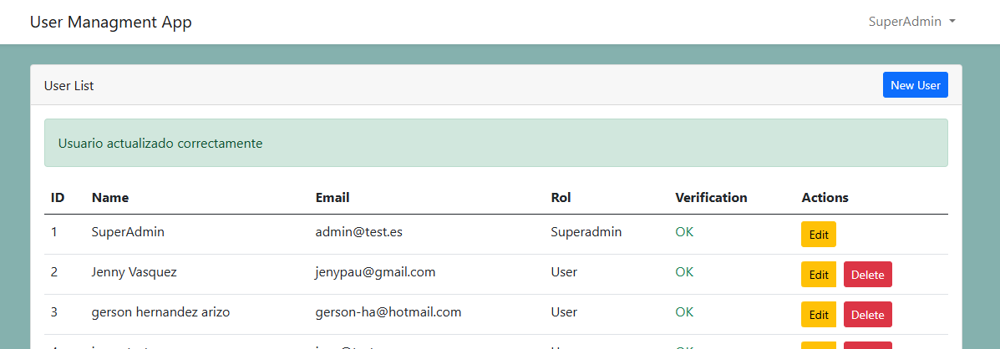
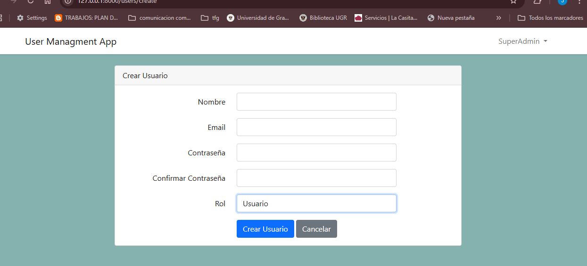

# Sistema de Gestión de Usuarios

Este es un **Sistema de Gestión de Usuarios** desarrollado con **Laravel**. Permite a los administradores gestionar cuentas de usuario, asignar roles y controlar permisos de acceso.

## Características

- **Autenticación de usuarios** (Inicio de sesión, Cierre de sesión, Registro)
- **Control de acceso basado en roles**
  - **Superadmin**: Puede gestionar todos los usuarios (excepto su propio perfil)
  - **Admin**: Puede editar su propio perfil y gestionar usuarios normales
  - **Usuario**: Solo puede editar su propio perfil
- **Operaciones**
  - Crear nuevos usuarios (Solo Admins y Superadmins)
  - Editar perfiles de usuario según los permisos
  - Eliminar usuarios (Solo Superadmins, pero no a sí mismos ni al usuario con ID 1)
- **Paginación en la lista de usuarios**
- **Validación de datos de usuario**

## Instalación

### Requisitos previos
Asegúrate de tener instalados los siguientes requisitos:
- PHP (>= 8.0)
- Composer
- Laravel (última versión)
- MySQL o SQLite (o cualquier base de datos compatible con Laravel)

### Configuración

1. Clonar el repositorio:
   ```bash
   https://github.com/Jenny-Vasquez/UserApp.git
   cd usereApp
   ```
2. Instalar dependencias:
   ```bash
   composer install
   ```
3. Copiar el archivo de entorno y configurar la base de datos:
   ```bash
   cp .env.example .env
   ```
   Actualiza `.env` con las credenciales de tu base de datos.

4. Generar la clave de la aplicación:
   ```bash
   php artisan key:generate
   ```

5. Ejecutar migraciones y poblar la base de datos:
   ```bash
   php artisan migrate --seed
   ```

6. Iniciar el servidor de desarrollo:
   ```bash
   php artisan serve
   ```

## Uso

- Regístrate o inicia sesión como usuario.
- Los Superadmins y Admins pueden acceder al panel de **Gestión de Usuarios**.
- Asigna roles al crear nuevos usuarios.
- Edita o elimina usuarios según los permisos establecidos.

## Permisos por rol
| Rol        | Crear Usuarios | Editar Usuarios | Eliminar Usuarios |
|------------|---------------|-----------------|--------------------|
| Superadmin | ✅            | ✅ (Todos excepto él mismo) | ✅ (Todos excepto él mismo y ID 1) |
| Admin      | ✅ (Solo usuarios) | ✅ (A sí mismo y a usuarios) | ❌ |
| Usuario    | ❌            | ✅ (Solo a sí mismo) | ❌ |

## Imagenes de la aplicacion
  
  
  
  
  
  
  
  
  
  
  
  
  
  

## Autor
Desarrollado por **Jenny Vásquez**

